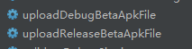
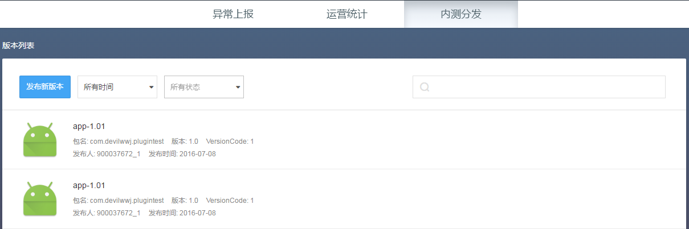

# Beta Gradle插件使用说明


在根目录下的build.gralde文件的depandencies（buildscript部分）中添加：

```
 dependencies {
        classpath 'com.tencent.bugly.plugin:betauploader:latest.release'
    }
```

其中latest.release为插件最新版，如需指定具体版本则指定如1.0.0。
在module的build.gradle文件的顶部添加：
```
apply plugin: 'com.tencent.bugly.plugin.betauploader'

beta {
    appId = '<App ID>'
    appKey = '<App Key>'
}
```
除了appId和appKey之外，还可以设置其他属性，属性列表如下：

| 属性 | 值  | 说明 |
| --- | --- | --- |
|appId |String| App ID <必选>|
| appKey |String| App Key <必选>|
| expId| String | 体验版本id，默认为空 |
| title | String | 版本名称，默认以`<projectname>-<version name><version code> `命名|
| desc | String | 版本描述，默认为空 |
| secret | int | 公开范围（1：所有人，2：密码，4管理员，5QQ群，6白名单，默认公开所有人）|
| users | String | 如果公开范围是"QQ群"填QQ群号；如果公开范围是"白名单"填QQ号码，并使用;切分开，5000个以内。其他场景无需设置|
| password | String | 密码(如果公开范围是"密码"需设置)| 
| download_limit | int |下载上限(大于0，默认1000)|
| apkFile| String | 指定上传的apk文件，如不指定则上传编译后的apk路径|
| enable | Boolean | 插件开关，默认为true|
| autoUpload | Boolean | 是否自动上传，默认为false |
| debugOn |Boolean | debug模式是否上传， 默认为false|


`<Project>/build.gradle`文件如下：
```
buildscript {
        repositories {
            jcenter()
        }
        dependencies {
            ...
            classpath 'com.tencent.bugly.plugin:betauploader:latest.release'
        }
    }}
```
其中“latest.release”引用插件最新版本，更新插件只需要Rebuild一下工程即可。

`<Project>/<Module>/build.gradle`文件如下：
```
apply plugin: 'betauploader'
    ...
    beta { 
        appId = '900000000'
        appKey = 'abcdefghijklmn'
    }
```

项目应用了Beta插件之后，插件默认是开启的，会在工程Gradle projects生成以下两个task：



可以直接点击执行或者在命令行输入以下命令：
```
gradle uploadReleaseBetaApkFile
```

上传成功之后就可以在内测平台看到版本信息：



