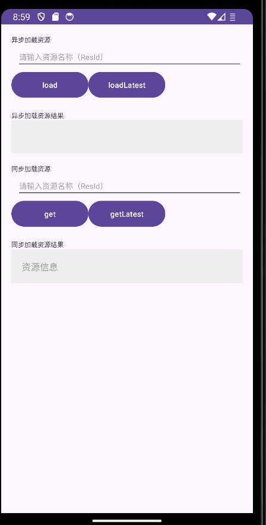

# ShiplyDemo使用说明

Bugly原有应用升级功能已经焕新为Shiply。

[Shiply](https://shiply.tds.qq.com/)是TDS腾讯端服务（Tencent Device-oriented Service）旗下的一站式客户端发布平台，提供了一套规则灵活、发布安全、高效分发的终端基础通用发布系统，功能包括：Android灰度发布，Android热修复、配置与开关发布、资源发布，帮助产品和技术团队提高研效能力和决策力。

## ShiplyUpgradeDemo使用说明
本Demo(app module)主要演示如何快速接入Shiply安装包灰度升级SDK，更多SDK接入细节可以参考[Shiply包灰度SDK接入文档](https://shiply.tds.qq.com/docs/doc?id=4008331373)。

安装本Demo启动后点击「手动检查更新」按钮，会弹出升级弹框：

点击弹框中「立即更新」按钮，会触发下载和安装。

SDK初始化代码位于app/src/main/java/com/devilwwj/plugintest/MyApplication.java文件的initShiplyUpgradeSDK方法中，Shiply用户可以将对应的appId和appKey替换为自己的值(也可以修改app module的build.gradle文件中的shiplyAppId/shiplyAppKey)，然后进行测试验证。

注意：
需要确保在Shiply前端已经创建了对应的升级任务，具体操作可以参考[Shiply灰度发布操作指南](https://shiply.tds.qq.com/docs/doc?id=4008374894)；
需要确保远端升级任务中APK文件的versionCode大于本地测试APK文件的versionCode;

## ShiplyConfigDemo使用说明
本Demo(shiplyConfigDemo module)主要演示如何快速接入Shiply配置开关SDK，更多SDK接入细节可以参考[Shiply配置开关SDK接入文档](https://shiply.tds.qq.com/docs/doc?id=4009966804)。

Demo主要包括远程配置拉取与本地配置查询两大块：

### 远程配置拉取
- 点击「REQ_FULL」按钮，可以触发全量配置拉取请求；
- 输入单个配置KEY后，点击「REQ_SINGLE」按钮，可以触发单个配置拉取请求；
- 输入多个配置KEY后，点击「REQ_MULTI」按钮，可以触发批量配置拉取请求；

### 本地配置查询
- 输入配置KEY后，点击「GET_SWITCH」按钮，可以查询对应配置KEY的开关值；
- 输入配置KEY后，点击「GET_CONFIG」按钮，可以查询对应配置KEY的配置值；
- 输入配置KEY后，点击「GET_DATA」按钮，可以查询对应配置KEY的开关值和配置值；

SDK初始化代码位于app/src/main/java/com/example/shiplyconfigdemo/MyApplication.java文件的initShiplyConfigSDK方法中，Shiply用户可以将对应的appId和appKey替换为自己的值，然后进行测试验证。

注意：
需要确保在Shiply前端已经创建了对应的升级任务，具体操作可以参考[Shiply配置与开关发布操作指南](https://shiply.tds.qq.com/docs/doc?id=4009966808)；

## ShiplyResDemo使用说明
本Demo(ShiplyResDemo)主要演示如何快速接入Shiply资源发布SDK，更多细节可以参考https:[Shiply资源发布SDK接入文档](//shiply.tds.qq.com/docs/doc?id=4010893730)

Demo主要包括远端资源拉取和本地配置查询两块：

### 远端资源拉取
- 在「load」按钮后输入想要拉取的资源名称，点击「load」按钮，开始拉取资源，结果在下方文本框中显示。
- 在「loadLatest」按钮后输入想要拉取的资源名称，点击「loadLatest」按钮，开始拉取最新资源，结果在下方文本框中显示。

### 本地资源获取
- 在「get」按钮后输入想要获取的资源名称，点击「get」即可获取资源相关信息，相关信息会显示在下面的文本框中。
- 在「getLatest」按钮后输入想要获取的资源名称，点击「getLatest」即可获取最新资源相关信息，相关信息会显示在下面的文本框中。

SDK初始化代码位于shiplyResDemo/src/main/java/com.example.shiplyresdemo/MyApplication.kt中，Shiply用户可以根据自己的设备、需求修改配置，在shiplyResDemo/src/main/java/com.example.shiplyresdemo/MainActivity.kt文件的onCreate方法中，Shiply用户可以将对应的appId和appKey替换为自己的值，然后进行测试验证。

注意：
需要确保在Shiply前端已经发布了对应的资源，具体操作可以参考[Shiply资源发布SDK接入文档](//shiply.tds.qq.com/docs/doc?id=4010893730)；

